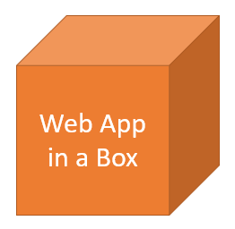

# Web App in a Box

The goal of this project is to have a "ready to go" front-end UI with many necessary web app features in order to scale web development.

Features include:

- User registration and login
- Main menu/page
- Cookie based authentication with JWT token support
- Refresh token support
- Works well with [API in a Box](https://github.com/hirre/api-in-a-box)
- and more...
